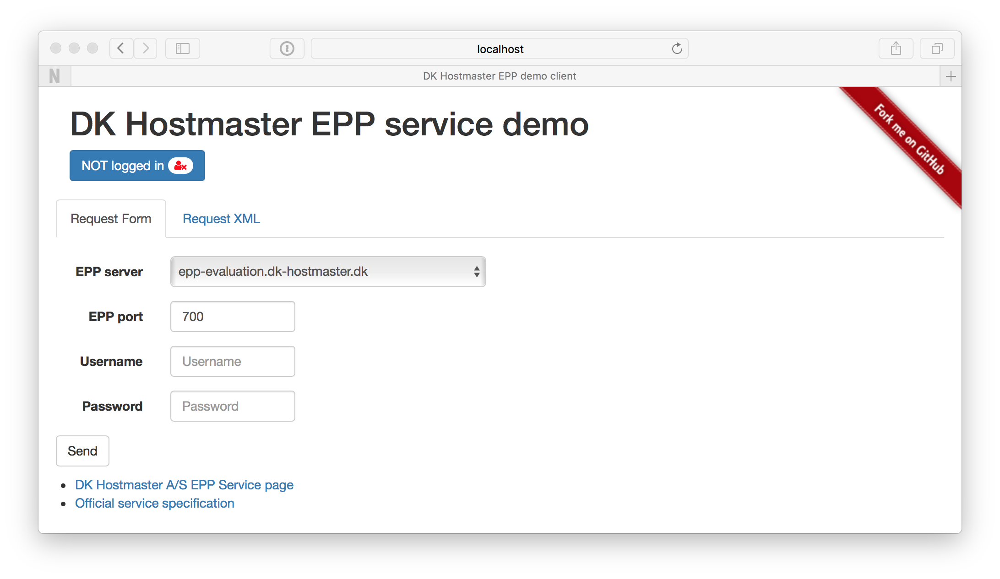

# NAME

DK Hostmaster EPP service demo client

# VERSION

This documentation describes version 1.1.0

# USAGE

    $ morbo -l https://*:3000 client.pl

Open your browser at:

    https://127.0.0.1:3000/

## Using `docker`

The application can be used using `docker`

    $ docker build -t epp-demo-client .

    $ docker run --rm -p 3000:3000 --name epp-demo-client epp-demo-client

Open your browser at:

    https://localhost:3000/

# DEPENDENCIES

This client is implemented using Mojolicious in addition the following
Perl modules are used and all are available from CPAN.

- [Mojolicious](https://metacpan.org/pod/Mojolicious)
- [Net::EPP::Client](https://metacpan.org/pod/Net::EPP::Client)
- [XML::Twig](https://metacpan.org/pod/XML::Twig)
- [TryCatch](https://metacpan.org/pod/TryCatch)
- [Benchmark](https://metacpan.org/pod/Benchmark)
- [Net::IP](https://metacpan.org/pod/Net::IP)
- [Mojolicious::Plugin::AssetPack](https://metacpan.org/pod/Mojolicious::Plugin::AssetPack)
- [CSS::Minifier::XS](https://metacpan.org/pod/CSS::Minifier::XS)
- [JavaScript::Minifier::XS](https://metacpan.org/pod/Javascript::Minifier::XS)
- [Mozilla::CA](https://metacpan.org/pod/Mozilla::CA)
- [IO::Socket::SSL 1.94](https://metacpan.org/pod/IO::Socket::SSL)

In addition to the above Perl modules, the client uses [Twitter Bootstrap](http://getbootstrap.com/) and hereby jQuery. These are automatically downloaded via CDNs and are not distributed with the client software.

# SEE ALSO

For information on the service, please refer to [the specification](https://github.com/DK-Hostmaster/epp-service-specification) from DK Hostmaster or [the service page with DK Hostmaster](https://www.dk-hostmaster.dk/en/epp).

The main site for this client is the Github repository.

- https://github.com/DK-Hostmaster/epp-demo-client-mojolicious

# COPYRIGHT

This software is under copyright by DK Hostmaster A/S 2016-2019

# LICENSE

This software is licensed under the MIT software license

Please refer to the LICENSE file accompanying this file.
